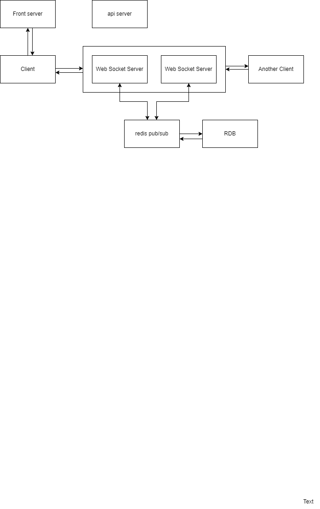

2024년 6월 30일
문서작업 시작

문서를 남겨야지 여러모로 좋을 것 같아서 남기는 작업일지.
일단은 남겨놔야지 나중에 정리해서 사용한다고 생각이 들어서 횡설수설해도 일단은 기록을 남기려 한다.
자기 pr용 ppt 는 나중에 깔끔하게 작업하기로 하고 문서도 이쁘게 하는것도 나중에 하고 일단 쓴다.
html 모양 나오는것도 나중에 하자.

현재 생각하고 있는 방향으로는 대규모 트래픽을 감당 할 수 있는 실시간 채팅 프로그램이다.
우선 나누어야 되는 모듈별로는
1. 프론트 앱
2. api server
3. web socket server (이하 wss)
4. Document Server for Gitpage
정도로 생각한다.

wss 를 두 대 이상 둔다는 가정으로 만드는데 프로세서 흐름으로는
1. 프론트 서버에 앱 or 웹페이지를 로드한다.
2. 앱과 api server가 통신하여 로그인 및 여러 정보를 받는다.
3. 웹소켓서버중 한개와 연결을 한다. (여러 서버중 어디에 연결할지는 api 서버에서 받는다)
4. 연결되면 db에서 사용자가 접속중인 channel(채팅방 id)들에 redis pub/sub 연결한다.
5-1. 채팅을 입력하면 wss 로 데이터가 넘어와서 redis pub/sub로 전송한다.
5-2. redis pub/sub 에서 데이터가 넘어오면 wss 에서 클라이언트로 메세지를 전송한다.

현재 고민중인 것으로
1. 여러 모듈들을 lan 으로 통신할 수 있게 하는가 wan으로 하게 하는가
lan으로 통신한다면 내부ip를 고정하여 사용할 것인가
2. 카카오에서는 wss들이 session info repository 안에 정보를 저장하고 각 wss들이 직접 통신하는 것 같은데 redis pub/sub를 두는것이 맞을까
redis pub/sub 가 아닌 다른 방식으로 하는것이 나을까

고민에 대한 현재의 결론과 방향성을 읊어보자면
고민1. 모르니까 일단은 되도록 만든 후에 lan 방식으로 우선 해보자.
계속 고민해보면서 가능하다면 내부ip를 고정으로 박지만 신규 서버가 들어온다면 다른 기존 서버들을 직접 수정을 안해도 되도록만 해보자
고민2. 이것또한 모르니까 머리 박아보면서 성능 테스트를 해보자. 성능테스트를 하다 보면 이 기술도 익숙해져서 좋겠지 뭐 일단 하고 생각함

